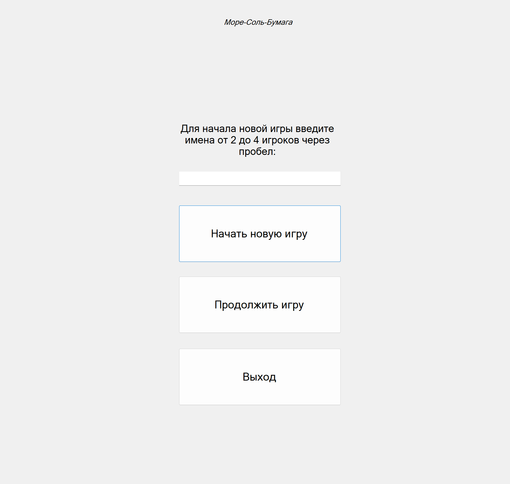
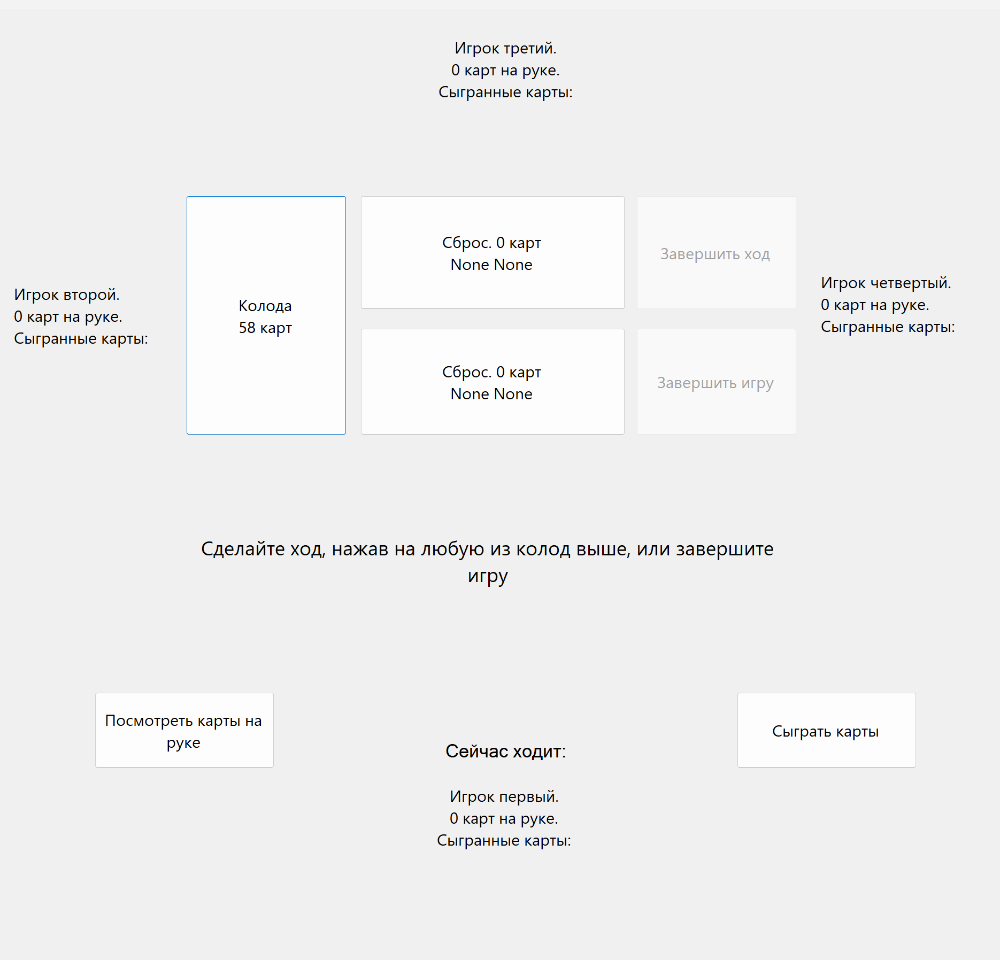
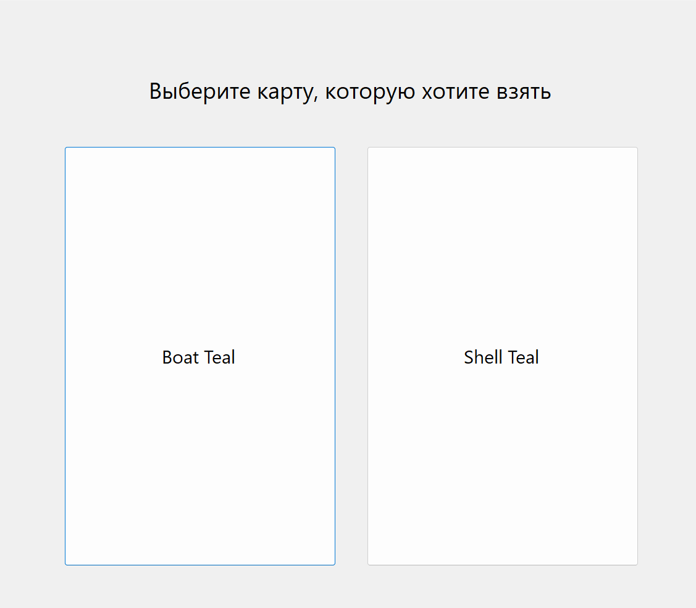
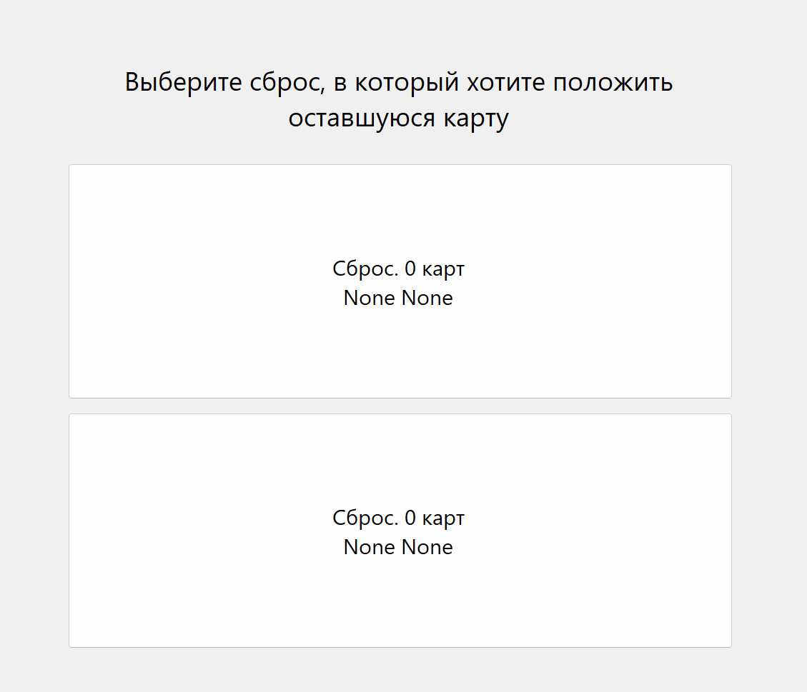
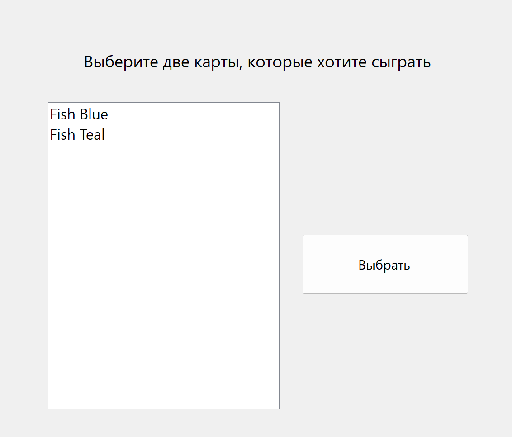
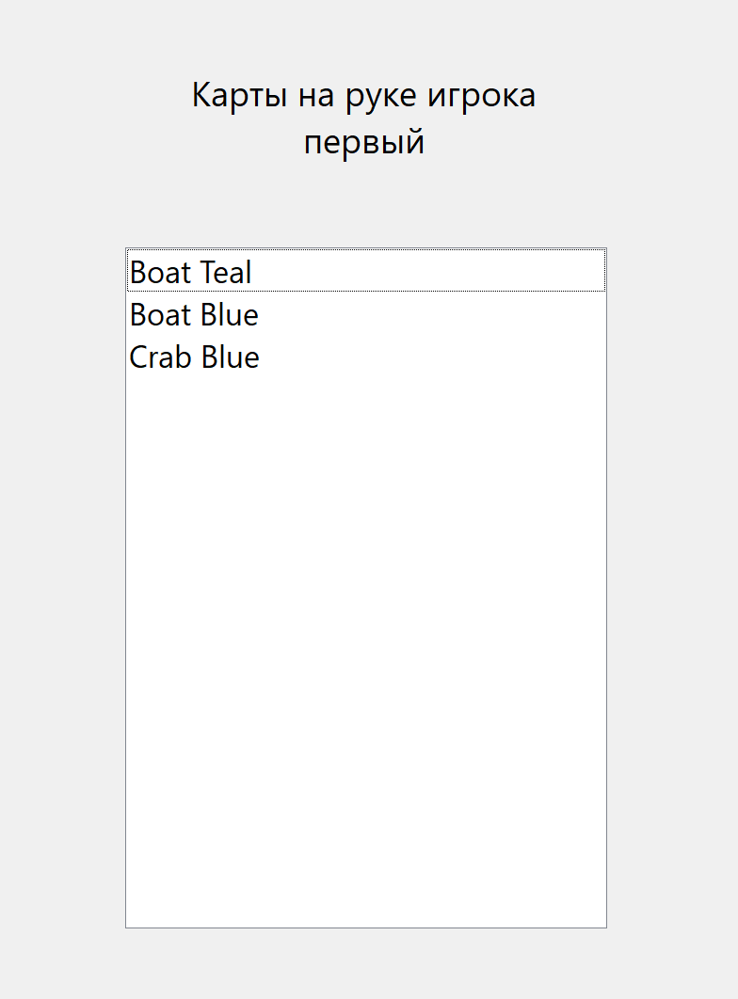

# Проект по курсу "Проектирование программного обеспечения" МГТУ ИУ7. 6 семестр, весна 2025.

# Компьютерная реализация настольной игры "Море, Соль, Бумага"

## Цель проекта

Цель проекта заключается в создании программной реализации настольной карточной игры "Море, Соль, Бумага". Игра основывается на взаимодействии с колодой карт и составлении из них комбинаций. Проект должен включать в себя интерфейс, позволяющий принять участие 2-4 игрокам.

## Функциональные требования

Реализация полного игрового цикла, от начала партии до завершения и подведения итогов. Своевременное сохранение актуальной информации о партии в базе данных. Возможность загрузки старой партии для продолжения игры. Реализация взаимодействия пользователей с колодами и картами на руке.

## Use-Case диаграмма

## ER диаграмма

## User-Flow диаграмма

## Диаграмма компонентов

## Пример интерфейса

### Начало игры

### Основной игровой интерфейс

### Взаимодействие с колодой

### Взаимодействие со сбросами

### Взаимодействие с картами на руке (использование)

### Взаимодействие с картами на руке (просмотр)

