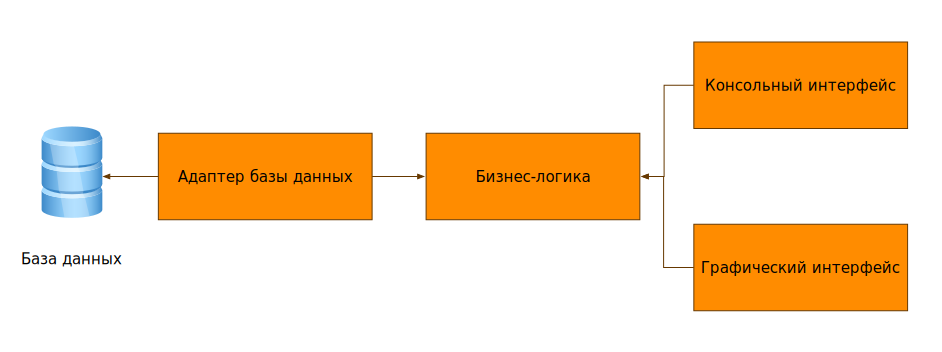
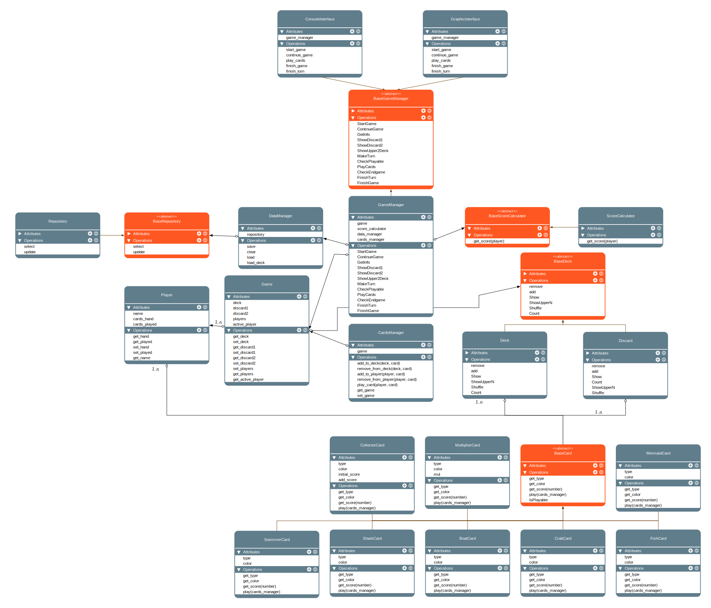

# Проект по курсу "Проектирование программного обеспечения" МГТУ ИУ7. 6 семестр, весна 2025.

## Компьютерная реализация настольной игры "Море, Соль, Бумага"

### Цель проекта

Цель курса - научиться разрабатывать приложение от архитектурной идеи до полноценной реализации, применяя принципы чистой архитектуры и строгого разделения слоёв. Курс направлен на формирование навыков проектирования доменной модели, выделения сущностей и бизнес-логики, разработки use-case-ов, работы с источниками данных (БД, файловая система, API) и создания пользовательского интерфейса. Практическая работа строится вокруг одного проекта, который постепенно дополняется и улучшается.

### Функциональные требования

Игра основывается на взаимодействии с колодой карт и составлении из них комбинаций. Проект должен включать в себя интерфейс, позволяющий принять участие 2-4 игрокам. Реализация полного игрового цикла, от начала партии до завершения и подведения итогов. Своевременное сохранение актуальной информации о партии в базе данных. Возможность загрузки старой партии для продолжения игры. Реализация взаимодействия пользователей с колодами и картами на руке.

### Use-Case диаграмма

### ER-диаграмма

### User-Flow диаграмма

### Диаграмма компонентов

### Диаграмма классов

### Пример работы

#### Начало игры

#### Основной игровой интерфейс

#### Взаимодействие с колодой

#### Взаимодействие со сбросами

#### Взаимодействие с картами на руке (использование)

#### Взаимодействие с картами на руке (просмотр)

